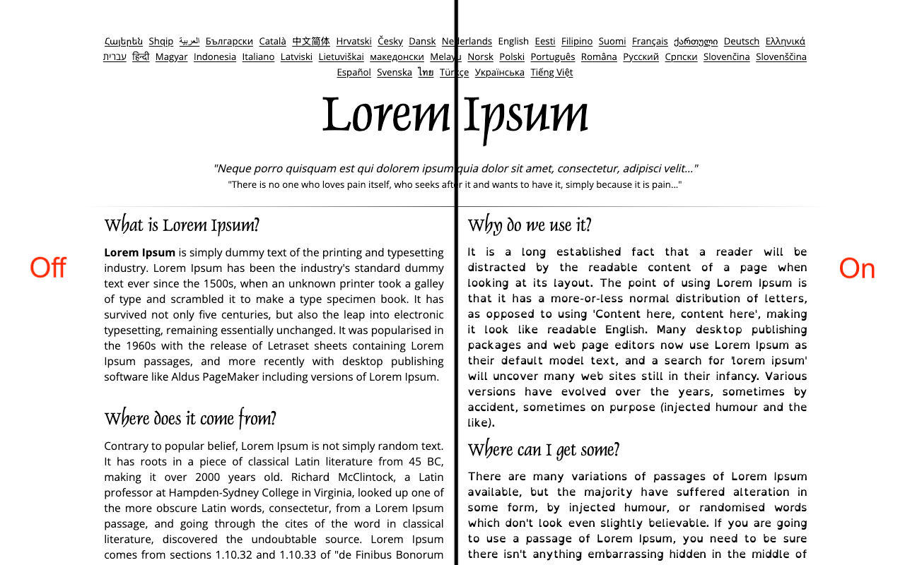

# OpenDyslexic Chrome Extension

A Chrome extension that applies the OpenDyslexic font to paragraph text elements on websites while preserving original styling for headings and UI elements.

**[Install from Chrome Web Store](https://chromewebstore.google.com/detail/opendyslexic-font-toggle/agceondhhepedllcileeclncgnabimmg)**

## Features

- ✨ One-click toggle via extension icon
- 🎯 Applies OpenDyslexic font only to specified elements (paragraphs by default)
- ⚙️ Configurable element targeting (lists, blockquotes)
- 🌐 Site-specific rules and overrides
- 💾 Syncs settings across Chrome browsers (when signed in)
- 🎨 Preserves original fonts for headings, navigation, and UI elements

<p align="center"></p>

## Installation

### For Development/Testing

1. **Download or clone this repository**

2. **Generate Icon Files**
   - Open `create-icons.html` in your browser
   - Download all three icon files (icon16.png, icon48.png, icon128.png)
   - Save them to the `icons/` folder

3. **Load Extension in Chrome**
   - Open Chrome and navigate to `chrome://extensions/`
   - Enable "Developer mode" (toggle in top-right corner)
   - Click "Load unpacked"
   - Select the `OpenDyslexicChromeExtension` folder

4. **Verify Installation**
   - You should see the extension in your extensions list
   - Visit any webpage and click the extension icon to toggle the font

**Note:** This extension only requires `activeTab` permission, meaning it only accesses pages when you click the extension icon. No broad host permissions are needed.

## Usage

### Basic Toggle

Click the extension icon in the Chrome toolbar to open the popup and toggle the font on/off for the current site.

### Configuration

Click the extension icon and select "Open Settings" to access configuration options:

#### Default State

- **Off by default** (recommended): Extension starts disabled on new sites
- **On by default**: Extension starts enabled on all sites

#### Additional Elements

- [ ] Apply to list items (`<li>`)
- [ ] Apply to blockquotes (`<blockquote>`)

*Note: Paragraphs (`<p>`) always receive the OpenDyslexic font when enabled*

#### Site-Specific Settings

Create custom rules for individual websites:

1. Navigate to the website
2. Click the extension icon
3. Click "Add Current Site to Rules"
4. Choose from:
   - **Disable extension** on this site (completely disable)
   - **Always enable** font on this site
   - **Always disable** font on this site

Manage all site rules from the Settings page.

## Technical Details

- **Manifest Version**: V3
- **Font Source**: CDN (<https://cdn.jsdelivr.net/npm/open-dyslexic@1.0.3/>)
- **Storage**: `chrome.storage.sync` (syncs across devices)
- **Permissions**: `storage`, `activeTab`, `scripting`
- **Injection Method**: Dynamic script injection (no broad host permissions required)

## File Structure

```
OpenDyslexicChromeExtension/
├── manifest.json          # Extension configuration (Manifest V3)
├── background.js          # Service worker for script injection
├── content.js             # Content script (dynamically injected)
├── content.css            # Font styles (dynamically injected)
├── popup.html             # Extension popup interface
├── popup.js               # Popup logic
├── options.html           # Settings page
├── options.js             # Settings page logic
├── icons/                 # Extension icons
│   ├── icon16.png
│   ├── icon48.png
│   └── icon128.png
├── create-icons.html      # Icon generator utility
├── CLAUDE.md              # Developer guide
└── README.md              # This file
```

## Development

### Making Changes

1. Edit the relevant files in the extension directory
2. Go to `chrome://extensions/`
3. Click the reload icon (↻) on the extension card
4. Test your changes on a webpage

**Note:** You don't need to remove and re-add the extension when updating - simply clicking the reload icon is sufficient.

## Known Limitations

- Cannot inject into Chrome internal pages (`chrome://`, `chrome-extension://`)
- Cannot inject into Chrome Web Store pages
- Some sites with very aggressive CSS may require the `!important` override
- Font loading may take a moment on first page load

## Support

For issues, questions, or contributions:

- Open an issue on GitHub
- Check the [Developer Guide](CLAUDE.md) for technical details

## License

This extension uses the OpenDyslexic font, which is licensed under the [Creative Commons Attribution 3.0 Unported License](https://creativecommons.org/licenses/by/3.0/).

## Credits

- OpenDyslexic font by Abelardo Gonzalez
- Extension developed following accessibility best practices
